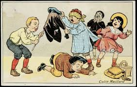
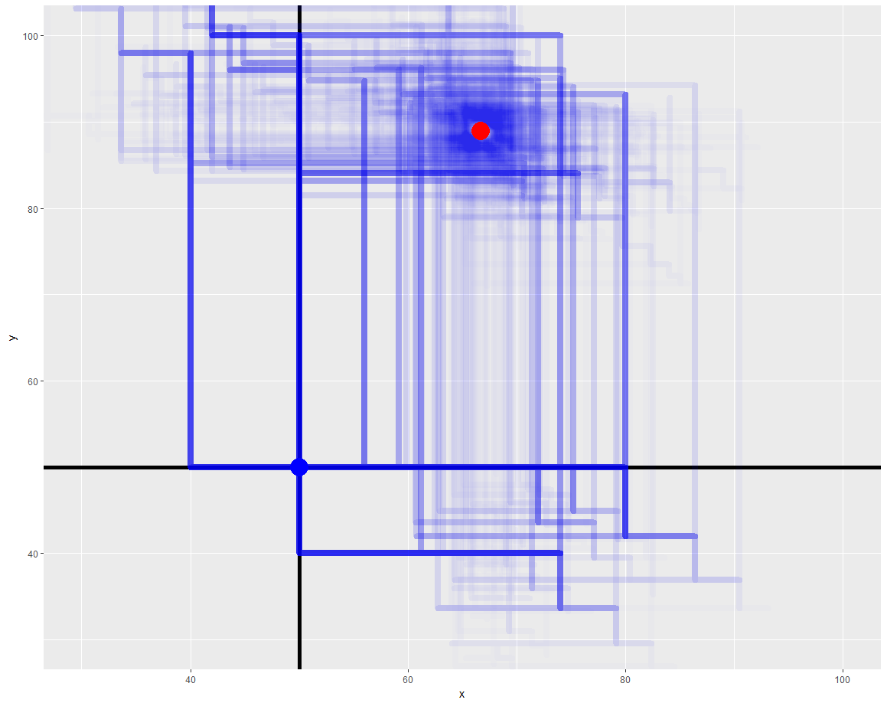

## Enfant VS Machine: who's the winner?

Quand on est un data scientist, peu de domaines de la vie courante échappent au besoin compulsif d’analyser des données. Et les enfants en bas age fournissent des sujet quasi inépuisables.

Dimanche dernier donc, nous jouions à trouver des objets cachés avec la fameuse technique du **« Tu chauffes.. ! Tu refroidis ! »** que tous les parents connaissent. Et je me suis dit, que finalement, est-ce que *l’enfant ne serait pas en train de chercher l’objet avec une pseudo technique de descente de gradient*, technique qui est au fondement de tout algorithme **d’optimisation ou d’intelligence artificielle**. Est-ce qu’intuitivement, l’enfant comprend ces notions de gradient ? Est-ce que la façon dont il cherche est optimale ? Quelles sont les contraintes du jeu ?

Avant cela, rappel théorique : l’algorithme de [descente de gradient](https://fr.wikipedia.org/wiki/Algorithme_du_gradient), ou plus forte pente, consiste à trouver l’optimum d’un set de paramètres en déplaçant ces paramètres graduellement, chacun dans le sens de plus grande pente. On l’utilise par exemple pour trouver les meilleurs coefficients d’un modèle complexe qu’on ne peut pas résoudre analytiquement. Certaines améliorations (adaptativité) permettent d’atteindre rapidement l’objectif, d’éviter d’être bloqué à certains endroits ou d’avoir des comportements chaotiques. L’un des paramètres important est le taux d’apprentissage (alpha), qui contrôle la diminution des pas qu’on fait à mesure qu’on s’approche de l’objectif.

Mais allons regarder cela un peu plus dans le détail, pour cela il faut modéliser le jeu :
1.	Un adulte cache un objet dans le plan (X, Y)
2.	L’enfant se place en (0, 0) et fait un premier déplacement aléatoire.
3.	L’adulte estime la distance à l’objet ; si elle a augmenté il annonce « tu refroidis », si elle a diminué il annonce « tu chauffes ». 
4.	L’enfant fait alors un nouveau déplacement, etc (retour en 3.)
5.	Quand il est suffisamment proche de l’objet, il l’aperçoit et annonce qu’il a trouvé.

Voila pour les règles, à présent parlons stratégie : il semble naturel que lorsqu’on « chauffe », il n’y ait pas de raisons de changer de direction, on continue à avancer au même rythme. Mais que se passe-t-il si soudain on s’éloigne ? Le problème (et la TRES grosse différence avec le vrai algorithme), c’est que l’on ne dispose :
- ni de la *décomposition* du gradient sur chacun des axes X, Y
- ni de sa *valeur* (on s’est rapproché à quel rythme ?)
Si on avait ça, la résolution par descente de gradient serait triviale :

Mais on n’a qu’une idée très vague de comment on doit ajuster le tir, c’est pour ça que beaucoup d’enfants au début n’arrivent pas à trouver (ne « convergent pas »)
La stratégie simple consiste à changer de direction lorsqu’on s’éloigne soudain : on peut soit faire demi-tour, soit prendre une perpendiculaire. L’autre question est : faut-il continuer à la même vitesse ou avancer plus lentement ? J’ai donc codé les différents principes
- **Principe 1** : On avance d’un pas constant, à moins qu’on fasse un changement de direction, à ce moment on diminue le pas d’un facteur alpha.
- **Principe 2** : Lorsqu’on change de direction, on choisit au hasard entre : faire demi-tour, aller orthogonalement à gauche ou à droite.
- **Principe 3** : Le critère de convergence est fixé à un écart quadratique de 1 de la cible.

**Variante** : on peut tester des directions non orthogonales pour mieux balayer l’espace ? Je propose alors de choisir la nouvelle direction en tirant un angle aléatoire dans une distribution ayant une forme « pondéré » : on veut plutôt favoriser les directions orthogonales mais pas seulement. On peut donc imaginer une densité de probabilité qui ressemblerait à ça (graphe du haut), et qui se modélise beaucoup plus facilement en tirant dans 3 distributions triangulaires :

Cela donne donc, sur le cercle trigonométrique, en imaginant qu’on arrive du bas, ce genre de répartition de la nouvelle direction :

Le paramètre le plus influent est en fait le taux d’apprentissage, qu'on a optimisé selon deux critères: le nombre d'itérations médian et le taux de convergence. Ce tableau est généré à partir de 2500 itérations à chaque fois:

Les performances des différentes stratégies sont résumées ici (note: On ne peut calculer un nombre d’itération moyen étant donné qu’il n’y a pas toujours convergence, on doit donc se contenter de la médiane)

| indicateur                 | Orthogonal ou marche arrière | Oblique aléatoire | Orthogonal pur |
|----------------------------|------------------------------|-------------------|----------------|
| Nb iterations médian       | 48                           | 47                | 16             |
| Taux convergence           | 99.9%                        | 100%              | 100%           |
| Taux apprentissage optimum | 0.8                          | 0.95              | 0.8            |

Etant donné un point cible, on peut égalemnet traçer la densité des trajets de ces deux algorithmes (qui ont un comportemnet très différent en fait, mais des performances assez proches):

## Conclusions :

Le meilleur algorithme semble être l’orthogonal pur. On pourrait bien entendu le complexifier en ajoutant de la mémoire (quelles zones du plan ont déjà été explorées, faire varier le step de facon dynamique, privilégier les directions où j’ai peu tourné jusqu’à présent, etc.)
 N’hésitez pas à me faire des retours sur marc.agenis@gmail.com
 
Et en bonus, l’application au *petit chaperon rouge* :

